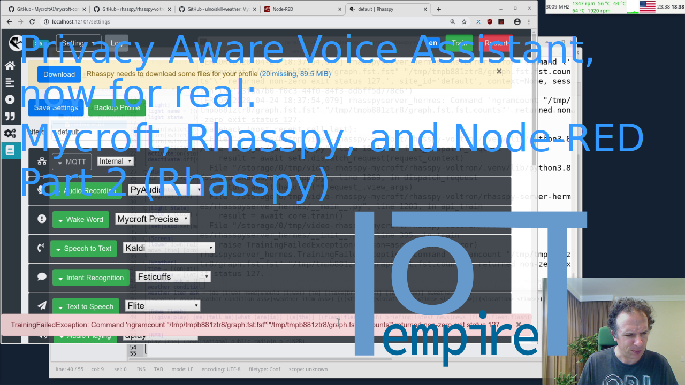

# Privacy Aware Voice Assistant, now for real: Mycroft, Rhasspy, and Node-RED - Part 2 (Rhasspy)



**Resources:**
- Video on YouTube: https://youtu.be/xKgPrn8ukcM
- Video on lbry:
- This page: https://github.com/ulno/doc/blob/master/videos/2020-04-25%20Rhasspy%2C%20node-red%2C%20mycroft/part2/desc.md

## Introduction
As you see I am fascinated by voice assistants, but I don't like them sending things into the cloud. Do I really want Google, Amazon, Apple, and Microsoft listen and analyze every word I say in my private four walls? How about voice assistants in an industrial setting - is it OK there to send everything to an external cloud provider? Not sure that such solutions will be easy to sell. And what happens when the Internet is down?

As excited as I initially was with Mycroft (https://mycroft.ai), I was a little disappointed to find out that they use (their own) third party cloud service to do speech to text. However, Mycroft is open source, so it allows me to exchange this service. After discovering Rhasspy (http://rhasspy.org, https://github.com/rhasspy/rhasspy-voltron, a system especially focusing on offline voice assistance).
I still like Mycroft and its community a lot, so what to do?

Hey, I am a software engineer, I thought: "I can glue systems together that don't have explicit interfaces for each other". So, let's use Node-RED (https://nodered.org) as glue!

Follow along in this mini-series. The series has 3 parts, we are now in the second and installing Rhasspy:

1. Installation Mycroft: https://youtu.be/-fYOf4WBvzk
2. Installation Rhasspy: https://youtu.be/xKgPrn8ukcM
3. Integration with Node-RED: https://youtu.be/hZwv80gB8f0

If you want to see the rest of the documentation with code examples, check this document here: https://github.com/ulno/doc/blob/master/videos/2020-04-25%20Rhasspy%2C%20node-red%2C%20mycroft/part2/desc.md


## Implementation

In this video, I am setting up Rhasspy 2.5. in a virtual python environment as described in this manual: https://github.com/rhasspy/rhasspy-voltron

To get all your dependencies on debian/ubuntu-like distros run this:
```
sudo apt-get update
sudo apt-get install \
    python3 python3-dev python3-setuptools python3-pip python3-venv \
    git build-essential libatlas-base-dev swig portaudio19-dev \
    supervisor mosquitto sox alsa-utils libgfortran4 \
    libfst-tools libngram-tools \
    espeak flite libttspico-utils \
    perl curl patchelf ca-certificates
```

On raspberry pi (probably also debian buster) skip ibttspico-utils.

For Arch/Manjaro-like distros, run:
```
sudo pacman -S base-devel swig portaudio mosquitto sox espeak flite git \
    python-pyaudio supervisor patchelf lapack dpkg
wget "http://mirrors.kernel.org/ubuntu/pool/universe/a/atlas/libatlas3-base_3.10.3-8ubuntu7_amd64.deb"
dpkg-deb -x libatlas3-base_3.10.3-8ubuntu7_amd64.deb libatlas
```
Also in arch, copy later content of libatlas/libs to .venv/lib (after creating the venv).

For any system, now continue the following way:
```
git clone --recurse-submodules https://github.com/rhasspy/rhasspy-voltron
cd rhasspy-voltron/
./configure  # this is new no configure necessary before (and not used in movie)
make
scripts/install-opengrm.sh download/opengrm-1.3.4-amd64.tar.gz .venv/tools/kaldi

# Not sure if really still necessary: copy all bin and lib from opengrm to .venv/lib and tools

scripts/install-precise.sh download/precise-engine_0.3.0_amd64.tar.gz .venv/tools
scripts/install-phonetisaurus.sh download/phonetisaurus-2019-amd64.tar.gz .venv/tools # also necessary on pi
```

Now you should be able to run rhasspy with:
```
PATH="$PATH:$(pwd)/.venv/tools:$(pwd)/.venv/tools/kaldi" bin/rhasspy-voltron --profile en
```

Then, you can configure and trigger downloads of language packages at http://localhost:12101/

Configuration as follows:
- Set a site-id (change from default to something recognizable - I use ulno-desktop here)
- MQTT: leave on internal
- Audio Recording: PyAudio (if trouble on desktop, use parec as Local Command), consider setting UDP port to 12102
- Wake Word: Mycroft Precise, consider setting UDP port field to localhost:12102
- Speech to Text: Kaldi
- Intent Recognition: Fsticuffs
- Text to Speech: flite (if you have a MaryTTS server, use that)
- Audio Playing: aplay (if trouble, try paplay as Local Command)
- Dialogue Manager: Rhasspy
- Intent Handling: disabled

Wait for download to complete if any of the errors from the movie happen, revisit extra installation steps from above.
Make sure the training works.

Here are my sample grammar and slots:
- [sentences](sentences.ini)
- [named days](named_days)
- [named times](named_times)
- [places](places)
- [weather condition](weather condition)
- [weather items](weather items)

Here is one of the issues I discussed in the movie: https://community.rhasspy.org/t/did-anyone-get-precise-working-as-a-wakeword-system-for-rhasspy-2-5/750/4

Hope the installation runs a bit smoother for you than for me.

Next part is here: https://github.com/ulno/doc/edit/master/videos/2020-04-25%20Rhasspy,%20node-red,%20mycroft/part3/desc.md


## End Matter

Links to all projects:
- Mycroft: https://mycroft.ai)
- Rhasspy: http://rhasspy.org, https://github.com/rhasspy/rhasspy-voltron
- Node-RED: https://nodered.org

And don't forget to check these web-sites and my own Instagram account:
- ulno's site: https://ulno.net
- ulno's Instagram: https://www.instagram.com/ulno_net/
- IoTempire: https://iotempire.net

I am also now on lbry, check my channel there too:
lbry://@ulno#2
 
As usual, stay tuned and see you next time!

#makers #IoT #IoTempire #diy #arduino #raspberrypi #opensource #nodered #Node-RED #rhasspy #mycroft #mycroft.ai #privacy
